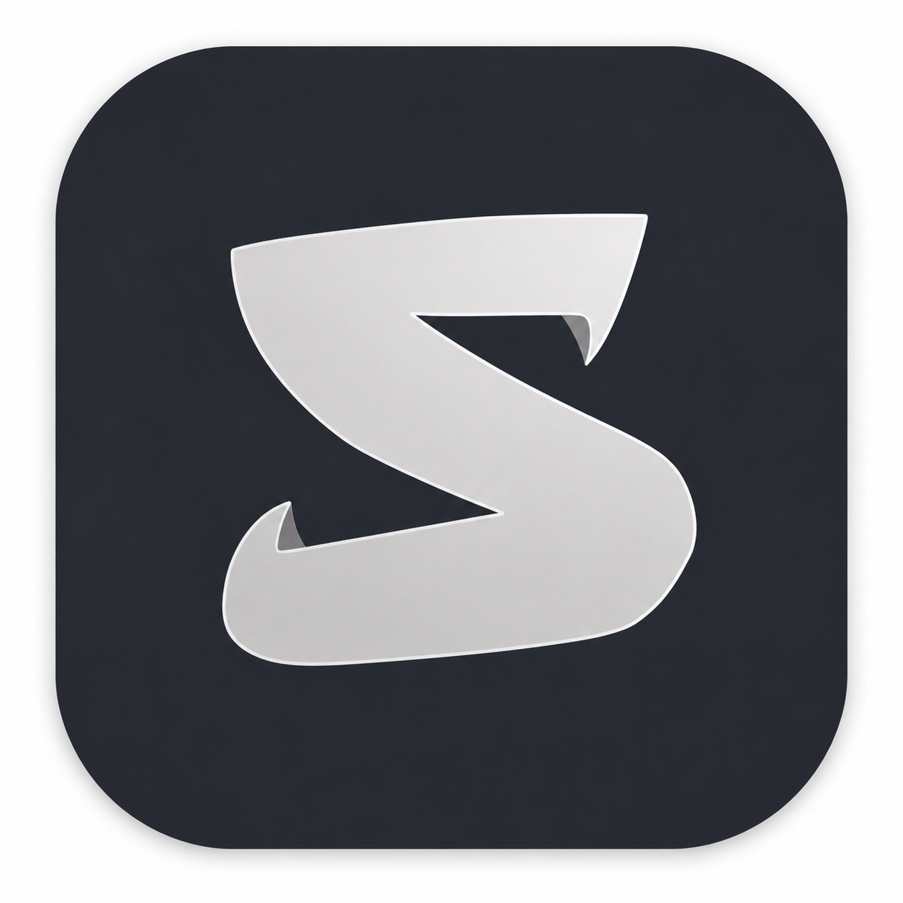

<div align="center">



# 🐱 silver

**A cozy, cat-powered IDE that lives in your terminal — or in its own window.**

*Fast. Tiny. One binary. No Electron, no telemetry, no 2 GB of helper processes.*


```
 /\_/\   ♪
( ^.^ ) ♫
 > ^ <
```

</div>

---

## What is silver?

silver is a lightweight IDE written in pure Rust. One tiny binary, two ways to run it:

- **Terminal mode** — a full TUI IDE inside any terminal you already have (~10 MB of RAM, works over SSH)
- **App mode** — the same IDE in its own native window, rendered on a crisp monospace grid with full mouse support

It's built around one idea: **your RAM belongs to your programs, not your editor.**

### Features

- ✂️ **Split editing** — two panes side by side; drag the divider (or `alt+←/→`) to resize
- 📑 **File rail** — open files live in a slim rail on the right edge; hover for names, click to swap
- ⌨️ **App-switcher for files** — `ctrl+tab` opens an OS-style overlay: tab through open files, enter swaps the pick into your last active pane
- 🖥️ **A real terminal inside** — a genuine PTY running your login shell: interactive CLIs (claude, python, git…), colors, arrow keys, tab-completion, and your usual prompt showing the current folder
- ▶️ **One-click run** — the ▶ button in the header runs the file you're editing (Rust, Python, JS/TS, Dart/Flutter, Go, C/C++, Java, shell, and more) in a terminal pane
- 🔴 **Live error detection** — stop typing for a second and your code is checked in the background; bad lines get a red wash, a `✗` in the gutter, and the message at the pane's edge. Works for Rust, Python, JS, Dart, C/C++, shell, and TOML using each language's own free tools — nothing to install, and files are checked the moment you open or save them too
- 💥 **Crashes pop up by themselves** — when a ▶ run fails, a window appears with the program's own error output, and the `file:line` it names turns red in your editor
- ⏸️ **Stop points & real debugging** — `ctrl+p` drops a red ● on a line; `ctrl+g` runs your program under a real debugger (lldb / pdb) that actually stops there, so you can step (`n`), continue (`c`), and print variables (`p x`) in the built-in terminal
- ✨ **Code suggestions as you type** — a small popup offers keywords and words from your own file; `↑/↓` to pick, `tab` to accept, `ctrl+space` to summon it
- 🎨 **Syntax highlighting** for Rust, JS/TS, Python, Go, C/C++, Java, shell, TOML/YAML, and more
- 🖱️ Mouse everywhere — click to place the cursor, drag tabs to split, scroll with the wheel (in the TUI too)
- 🌫️ Popups blur the background so you always know what's focused
- 🎛️ **Everything is remappable** — shortcut keys *and* terminal command words, from a built-in panel; saved to a simple `config.toml`
- 🖱️ **Open files your way** — by default, picking a file in the files panel copies its path for `open`; run `click on` to open files the moment you click (or press enter on) them instead — the terminal still works exactly the same either way
- 🐈 **A cat** — it blinks, snacks on sushi, watches your cursor, and sings along when music is actually playing on your machine (silver checks)

---

## Install

### Option A — download the ready-made app (no Rust needed)

One binary per OS. Each is **both** the terminal IDE *and* the windowed app.

| OS | Direct download | Then |
|---|---|---|
| macOS (Apple Silicon) | **[silver-macos-arm64.tar.gz](https://github.com/karanleo-coder/Silver_IDE/releases/latest/download/silver-macos-arm64.tar.gz)** | unpack, run `./silver_kb install-app` → **Silver** appears in Spotlight & the Dock with its logo |
| Linux (x86_64) | **[silver-linux-x86_64.tar.gz](https://github.com/karanleo-coder/Silver_IDE/releases/latest/download/silver-linux-x86_64.tar.gz)** | unpack, run `./silver_kb install-app` → **Silver** appears in your app launcher with its logo |
| Linux (arm64 — Raspberry Pi, ARM laptops) | **[silver-linux-arm64.tar.gz](https://github.com/karanleo-coder/Silver_IDE/releases/latest/download/silver-linux-arm64.tar.gz)** | unpack, run `./silver_kb install-app` → **Silver** appears in your app launcher with its logo |
| Windows (x86_64) | **[silver-windows-x86_64.zip](https://github.com/karanleo-coder/Silver_IDE/releases/latest/download/silver-windows-x86_64.zip)** | unpack, **double-click `silver_kb.exe`** → the app window opens; run `silver_kb.exe` from a terminal for the terminal IDE |

> Not sure which Linux build? Run `uname -m` — `x86_64` means x86_64, `aarch64` means arm64.
> Grabbing the wrong one is what causes `exec format error`.

All versions live on the **[Releases page](https://github.com/karanleo-coder/Silver_IDE/releases)**.

```sh
# macOS / Linux quick start after downloading:
tar -xzf silver-*.tar.gz
./silver_kb                # terminal IDE
./silver_kb --app          # windowed app
./silver_kb install-app    # add it to Spotlight / your app launcher
```

> macOS may warn about an unsigned app the first time: right-click → Open, or
> `xattr -d com.apple.quarantine silver_kb`.

> **Linux, windowed mode (`--app`) fails with "failed to load one of xlib's shared libraries"?**
> The terminal IDE still works — that error is specific to opening a window. Minimal
> Linux installs (server images, some ARM devices/dev boards) often ship the `-dev`
> build headers' runtime counterparts missing. Install them and try again:
> ```sh
> sudo apt-get install -y libx11-6 libxcursor1 libxrandr2 libxi6 \
>   libxkbcommon0 libwayland-client0 libgl1
> ```

### Option B — build it yourself with cargo

#### 1. Install Rust (one time)

**macOS / Linux**
```sh
curl --proto '=https' --tlsv1.2 -sSf https://sh.rustup.rs | sh
```

**Windows (PowerShell)**
```powershell
winget install Rustlang.Rustup
```
> On Windows, rustup will ask for the Visual Studio C++ Build Tools — let it install them.

#### 2. Install silver

**All platforms — one command:**
```sh
cargo install --git https://github.com/karanleo-coder/Silver_IDE
```

Cargo builds an optimized release binary and puts `silver_kb` on your PATH. Done.

#### 3. Run it

```sh
silver_kb              # inside your terminal — the lightest IDE you'll ever run
silver_kb --app        # as its own windowed app
silver_kb install-app  # macOS: Silver.app for Spotlight & Dock · Linux: app-launcher entry
```

**Updating:** re-run `cargo install --git https://github.com/karanleo-coder/Silver_IDE --force`
**Uninstalling:** `cargo uninstall silver-cli`

---

## Why silver instead of a big IDE?

| | 🐱 **silver** | VS Code | JetBrains IDEs | Sublime Text | Vim/Neovim |
|---|---|---|---|---|---|
| Typical memory | **~10 MB (TUI) / ~170 MB (app)** | 1–2 GB across ~8 processes | 1.5–4 GB (JVM) | ~100 MB | ~10 MB |
| Cold start | **instant** | seconds | 10 s+ | fast | instant |
| Install | **one command, one binary** | installer + update services | installer + toolbox | installer | package manager |
| Runs inside a terminal / over SSH | **yes** | no | no | no | yes |
| Real terminal built in | **yes (PTY)** | yes | yes | no | via plugins |
| Learning curve | **minutes** | low | medium | low | steep |
| Telemetry | **none** | on by default | on by default | none | none |
| Price | **free, MIT** | free | paid | $99 | free |

silver doesn't try to replace a full language-server setup for a million-line monorepo — that's not the goal. It's for when you want to open a project, edit, run, and use a real terminal **right now**, without the editor eating your machine.

---

## Using silver

### The home screen

Your cat greets you at the top. Pick a recent project with `↑/↓ + enter`, or `tab` into the side terminal and browse anywhere:

```
cd ~/some/folder     # the left panel becomes a folder browser
start                # open the editor there (or: start <path>)
```

`c` customizes the cat (name, color) — `k` opens the keys & commands panel.

### Default shortcut keys

| Keys | Action |
|---|---|
| `ctrl+t` | open the command popup |
| `ctrl+s` | save the active file |
| `ctrl+b` | toggle the files panel |
| `ctrl+o` | pick a file to open on the right |
| `ctrl+tab` | cycle / swap open files (app-switcher overlay) |
| `ctrl+w` | jump to the other pane |
| `ctrl+n` | next tab in this pane |
| `ctrl+x` | close the shown tab |
| `ctrl+l` | location dropdown (browse & copy paths) |
| `alt+←` / `alt+→` | resize the split |
| `ctrl+p` | toggle a ● stop point on the cursor's line |
| `ctrl+g` | debug run — stops at your stop points |
| `ctrl+space` | open the code-suggestion popup |
| `ctrl+h` | back to the home screen |
| `ctrl+q` | quit (warns about unsaved changes) |

### Popup terminal commands (`ctrl+t`)

| Command | What it does |
|---|---|
| `ls` | toggle the folder panel |
| `open <path>` | open a file beside the current one (`open` alone opens the last copied path) |
| `cd <path>` | switch project folder |
| `save` | save the active file |
| `spawn` | a **real** terminal tab, right where you are — the file slides aside, still visible |
| `run` | run the active file's program in a terminal |
| `check` | check the file for errors right now (aliases: `lint`, `errors`) |
| `break` | toggle a stop point on the cursor's line (aliases: `bp`, `stop`) |
| `debug` | run under a debugger, stopping at your stop points (aliases: `dbg`) |
| `keys` | view & edit shortcut keys *and* command words |
| `click on` / `click off` | open files by clicking (or pressing enter on) them in the files panel, instead of copying the path (aliases: `mouse`) |
| `cat name <name>` / `cat color <color>` | your cat, your rules (`pink`, `#ff79c6`, …) |
| `theme <color>` | accent color |
| `cursor <style>` | `block` · `bar` · `underline` · `hollow`, plus `cursor blink on/off` |
| `home` / `clear` / `exit` | the classics |

### Errors, stop points, and suggestions

- **Errors find you.** Pause typing for a second and silver checks your code with the language's own tools (`cargo check`, `dart analyze`, `python`, `node --check`, `cc`, `bash -n`, …). Bad lines get a red wash and a `✗` in the gutter; put the cursor on one and the full message appears at the pane's edge. Saving and opening files re-checks them too. If `shellcheck` or `pyflakes` are installed, silver uses them automatically for even sharper results.
- **Crashes explain themselves.** When a ▶ run exits with an error, a window pops up with the program's own output — and any `file:line` in a stack trace, panic, or traceback is marked red in your editor.
- **Stop the program where you want.** `ctrl+p` toggles a red ● stop point; `ctrl+g` builds and runs under a real debugger (lldb for Rust/C/C++, pdb for Python) with your stop points pre-set. In the terminal: `c` continues, `n` steps a line, `p someVariable` prints a value.
- **Suggestions as you type.** After two letters, a popup offers language keywords plus words from your file — `↑/↓` picks, `tab` accepts, `esc` dismisses, `ctrl+space` summons it on demand.

### The built-in terminal

`spawn` (or ▶ run) opens your **actual login shell in a PTY** — so `claude`, `python`, interactive prompts, colors, and tab-completion behave exactly like your normal terminal, and the prompt shows the folder you're working in. `ctrl+c` interrupts, `pgup/pgdn` or the wheel scrolls history, and the terminal pane swaps, splits, and resizes like any file tab.

### Make it yours

Open the customize panel (`k` on home, or `keys` in the popup). Two tabs, switch with `tab`:

- **keys** — select an action, press enter, then just *press the new combination* (e.g. `ctrl+p`)
- **commands** — select a command, press enter, type your own word — rename `spawn` to `t` if you like; `help` will speak your words from then on

Conflicts are refused with a friendly message, `d` restores any default, and everything saves instantly to one plain-TOML file you can also edit by hand:

- macOS: `~/Library/Application Support/dev.silver.silver-cli/config.toml`
- Linux: `~/.config/silver-cli/config.toml`
- Windows: `%APPDATA%\silver\silver-cli\config\config.toml`

```toml
open_on_click = true     # click (or enter) a file in the panel to open it directly

[cat]
name = "Miso"
color = "#ff79c6"

[theme]
accent = "orange"
cursor = "bar"            # block | bar | underline | hollow
cursor_blink = true

[keys]
popup_terminal = "ctrl+t" # rebind anything: "ctrl+p", "alt+x", ...

[commands]
spawn = "t"               # rename any command word
```

---

## Built with

[ratatui](https://github.com/ratatui/ratatui) · [egui/eframe](https://github.com/emilk/egui) · [portable-pty](https://github.com/wez/wezterm) · [vt100](https://github.com/doy/vt100-rust) — and a cat.

## License

MIT — do whatever makes you happy. If silver saves your RAM, give the cat a ⭐.
